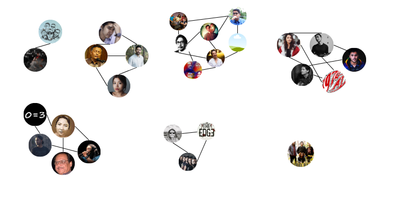
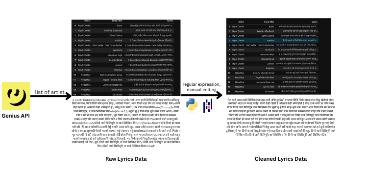

# NepaliLyricsClustering

Music is an art and a form of expression that involves Melody, Harmony, Rhythm, instruments and so on. The type of music or what we call a music genre is generally determined by different characteristics such as instruments, rhythms, cultural context or a geographical category. Lyrics maybe used as an identifier of a genre but one can argue that same lyrics can be sung in two different genre while expressing the same thing through language. 

In this project, titled Nepali Lyrics Clustering, I aim to group various Nepali artists based solely on the words they use in their songs. By analyzing the lyrical content, we can explore how closely related or distinct these artists are from one another. This approach not only highlights the richness of Nepali music but also contributes to a deeper understanding of the linguistic and thematic diversity within the genre.Given the unique characteristics of the Nepali language, this analysis is approached as a natural language processing (NLP) task. By leveraging NLP techniques, we can uncover patterns and relationships within the lyrics that may not be immediately apparent through traditional analysis.

# Data Collection And Preprocessing

For the dataset we have acquired lyrics from different nepali artists that spans multiple genre and artists. We used API from Genius to collect the music and lyrics, and compiled them to a csv files. The lyrics extracted had two problems: 
- Extra Information within the lyrics such as the name of the contributor,  information about the structure of music such as verse, intro, outro, bridge and so on.
- Some of the lyrics were in romanized form. Since the task was to analyse Nepali words, the romanized version was not suitable for the data.

I cleaned the data with the help of regular expression, string operation and pandas to work on all the lyrics. For romanized lyrics, I manually replaced them with nepali version or drop them if Nepali version was not found. However, english word and songs were kept in the database.
Similarly, stop words were identified and removed in this process.

# Data Representation and Embedding

Computers do not understand languages in the same way humans do; they require numerical representations to process text. To achieve this, I have employed Word2Vec, a powerful technique for transforming words into vectors of numbers. In this method, each word in the vocabulary is represented by a 50-dimensional vector, which captures the semantic relationships between words based on the contexts in which they appear.

To represent entire song lyrics, which consist of multiple words, I have used an average embedding technique. This approach calculates the average of all the word vectors within a song's lyrics, creating a single vector that represents the overall meaning or theme of the song. This combined vector serves as the foundation for clustering the artists based on their lyrical content, allowing us to compare and group artists who use similar themes and language patterns.

